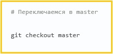

# Инструкция для работы с Markdown

+ Команды при начале работы Markdown

git config --global user.name "Михаил Матафонов"  -  *указываем своё имя*

git config --global user.email Matmix2015@yandex.ru  -  *указывем свою почту*

git config --global color.ui auto   -  *вклчает подсветку GIT при использовании терминала*

git config --global core.editor "[program]"   -  *установка редактора по умолчанию*

+ Основные команды

**git init** - создаёт локальный репозиторий

**git add .**  - добавляет файлу версионность в локальном репозитории

**git commit**  - это команда, которая фиксирует изминения и сообщает о появлении новых версий файлов

**git diff** - показывает разницу между текущей и уже зафиксированной версией файла

**git log**  - выводит список всех коммитов (сохранений) в хронологическом порядке

**git branch** - ветка в которой находимся

**git checkout**  - команда, позволяющая переключаться между ветками, например переход на ветку master 

**(message) -m**  - добавить сообщение "Что сделали?"

**ls** - список файлов в нашей директории

**cd (chang directoriy)** выбор директории

**~ (тильда)** - точка старта нашего пути (домашняя директория)

**cd ~** попасть в папку пользователя

**cd..**   - нам нужна папка на уровень вышей текущей
**cd../..** на 2 папки выше

**mkdir**   - создать новую директорию + дать название ей например: mkdir TestDir  далее проверить ls (появится список и в нем будет TestDir)
**touch**   - создать новый пустой файл + дать название ей например: touch test.txt

**copy (cp)** - создать копию файла  например: cp test.txt test_copy.txt

**move (mv)**  - переименовать файл  например: mv test.txt test_original.txt

**echo "Hello"**  - записать что-то быстро в файл, какой-либо текст  например: echo "Hello"
**echo "Hello" > test_original.txt**  запись в конкретный файл
**cat test_original.txt**  узнать записалось ли в файл далее ls (проверить список директории)

**remove (rm)**  -удалить файл например: rm test_original.txt  (полное удаление файла, директорию удалить нельзя, только файл,)
**rm -R**  - удалить директорю и все что внутри например: rm -R TestDir
 
**git log --oneline**  выводит все коммиты (комментарии списком)

## Выделение текста

Выделение текста курсивом (*). Например, *Курсив*. Так же можно выделить знаком (_). Например, _Курсив_

Выделение текста полужирным (**). Например, **Полужирный**. Так же можно выделить двойным знаком (__). Например, __Полужирный__
## Списки

## Работа с изображениями

Чтобы вставить изображение в текст, достаточно написать следующее:

![] -  если возникает ошибка, то между скобками пишем текст, и отображаться будет он.

() - сюда указываем название файла

## Ссылки

## Работа с таблицами

## Цитаты

## Заключение